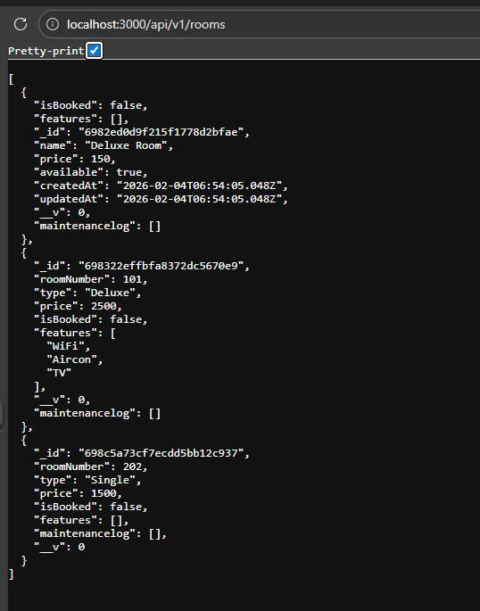

RESTful API Activity-Nino Emmanuel R. Noche

Best Practices Implementation

*1. Environment Variables*
**Why did we put BASE_URI in .env instead of hardcoding it?**
It's a smart way to keep things like URLs flexible and safe. If the base URL changes, we don't have to dig into the code—just update the .env file. Plus, it keeps sensitive stuff out of version control, so no accidental leaks on GitHub or wherever.

*2. Resource Modeling*
**Why do we use plural nouns (e.g., /dishes) for our routes?**
Using plurals like "dishes" makes it clear we're dealing with a collection of items, which is a standard REST practice. It keeps the API easy to understand, consistent, and ready to grow without confusing anyone.

*3. Status Codes*
**When do we use 201 Created vs 200 OK?**
Go with 201 Created when you've just made a brand new resource, like adding a dish to the menu. Use 200 OK for regular successful stuff, like fetching data without creating anything new.
Why is it important to return 404 instead of an empty array or generic error?
A 404 Not Found straight-up tells the client "hey, that thing doesn't exist," which helps them handle errors better. An empty array or vague message might make them think something else is wrong, leading to confusion.

*4. Testing*

**Why did I choose to Embed the maintenance?**
Since maintenance logs are small and room-based, it is better to store them inside the room data. This makes queries easier and improves performance.

**Why did I choose to Reference the Guest in Booking?**
Rooms and guests are separate records in the system. They can exist on their own even without a booking, and each can be linked to many bookings over time. Using references instead of copying their details prevents duplicate data and helps keep the information accurate and consistent throughout the system.

1. Authentication vs Authorization:
o What is the difference between Authentication and Authorization in our
code?

o Answer: Authentication means confirming the identity of a user such as when the system checks their email and password during login. Authorization on the other hand means checking what actions that user is allowed to perform, like verifying if they have an admin role before allowing them to delete a room.

2. Security (bcrypt):

o Why did we use bcryptjs instead of saving passwords as plain text in
MongoDB?

o Answer: Using bcryptjs instead of saving passwords as plain text in MongoDB to keep user accounts more secure. It converts passwords into hashed values, so even if the database is hacked, attackers cannot easily see or use the real passwords.

3. JWT Structure:

o What does the protect middleware do when it receives a JWT from the
client?

o Answer: It gets the token from the request header (Authorization: Bearer token). Then it checks if the token is valid using the JWT_SECRET. After that, it reads the user ID from the token and attaches it to req.user so the system knows who is making the request.